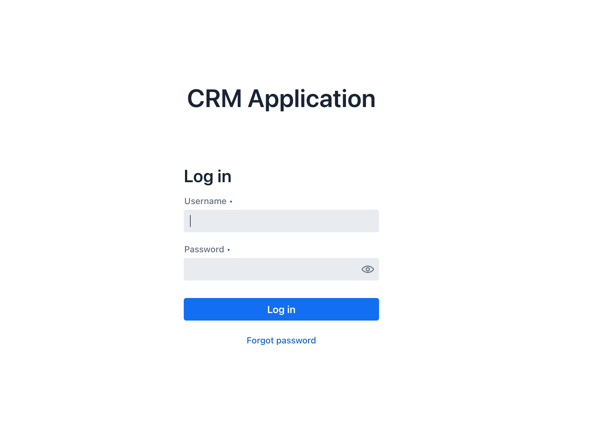
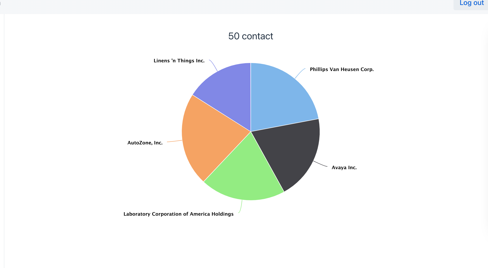

# Flow CRM

This project can be used as a starting point to create your own Vaadin application with Spring Boot.

-----

## Running the application

The project is a standard Maven project. 
To run it from the command line, type `mvnw` (Windows), or `./mvnw` (Mac & Linux), then open
`http://localhost:8080` in your browser.

You can also import the project to your IDE of choice as you would with any
Maven project. Read more on [how to import Vaadin projects to different 
IDEs](https://vaadin.com/docs/latest/flow/guide/step-by-step/importing) (Eclipse, IntelliJ IDEA, NetBeans, and VS Code).

## Deploying to Production

To create a production build, call `mvnw clean package -Pproduction` (Windows),
or `./mvnw clean package -Pproduction` (Mac & Linux).
This will build a JAR file with all the dependencies and front-end resources,
ready to be deployed. The file can be found in the `target` folder after the build completes.

Once the JAR file is built, you can run it using
`java -jar target/flowcrmtutorial-1.0-SNAPSHOT.jar`

## Project structure

- `MainLayout.java` in `src/main/java` contains the navigation setup (i.e., the
  side/top bar and the main menu). This setup uses
  [App Layout](https://vaadin.com/components/vaadin-app-layout).
- `views` package in `src/main/java` contains the server-side Java views of your application.
- `views` folder in `frontend/` contains the client-side JavaScript views of your application.
- `themes` folder in `frontend/` contains the custom CSS styles.

## Useful links

- Read the documentation at [vaadin.com/docs](https://vaadin.com/docs).
- Watch training videos and get certified at [vaadin.com/learn/training](https://vaadin.com/learn/training).
- Create new projects at [start.vaadin.com](https://start.vaadin.com/).
- Search UI components and their usage examples at [vaadin.com/components](https://vaadin.com/components).
- View use case applications that demonstrate Vaadin capabilities at [vaadin.com/examples-and-demos](https://vaadin.com/examples-and-demos).
- Discover Vaadin's set of CSS utility classes that enable building any UI without custom CSS in the [docs](https://vaadin.com/docs/latest/ds/foundation/utility-classes). 
- Find a collection of solutions to common use cases in [Vaadin Cookbook](https://cookbook.vaadin.com/).

